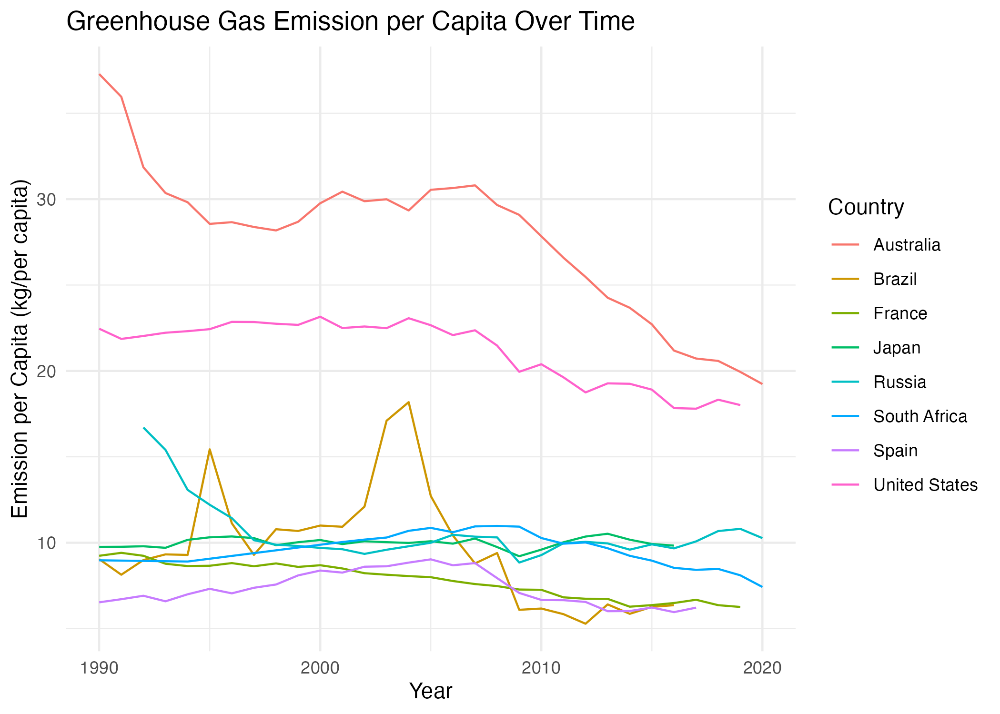

# Greenhouse Gas Emissions and Nutrient Dynamics in Agriculture

## Overview
This repository contains a comprehensive report on greenhouse gas emissions and nutrient dynamics in agriculture, with a specific focus on France as a case study. The report explores the trends, causes, and consequences of greenhouse gas emissions and nutrient utilization in agricultural systems, emphasizing their implications for climate change and food security.

## Report Structure
The report is organized into various sections, providing a structured approach to understanding the subject matter. Here's an overview of the sections:

1. **Introduction:** Sets the stage for the report's focus on greenhouse gas emissions and nutrient dynamics in agriculture.
2. **Existing Knowledge:** Provides background information and context for the research questions.
3. **Research Questions:** Clearly states the three research questions guiding the investigation.
4. **Significance of the Report:** Highlights the importance of the research in contributing to our understanding of agriculture's environmental impact.
5. **Data:** Describes the data sources, with a specific emphasis on utilizing OECD data for analysis.
6. **Methods:** Outlines the statistical methods employed to answer the research questions.
7. **Results:** Presents the findings for each research question through visualizations and analyses.
8. **Conclusion:** Summarizes key insights drawn from the research.

## Research Questions

### 1. How have greenhouse gas emissions changed over time on a per capita basis for each country?

We observed diverse patterns in greenhouse gas emissions per capita across countries. Utilizing scatter plots and tables, we visualized changes for eight countries from 1990 to 2019, exploring potential influencing factors such as policy shifts, economic dynamics, and technological advancements.

### 2. What is the relationship between greenhouse gas emissions (index) and time in France, and can a linear regression model be applied to predict emissions for the next 20 years?

In France, we identified a decreasing trend in the greenhouse gas emissions index, indicating successful emission reduction efforts. Employing linear regression and second-degree polynomial models, we predicted future emissions, determining that the polynomial model exhibited superior accuracy in forecasting.

### 3. How does the relationship between phosphorus and nitrogen levels compare to agricultural emissions in the USA and France?
Analyzing phosphorus and nitrogen trends alongside agricultural emissions revealed stable or decreasing levels in the USA and France. Line plots visualized these trends from 1990 to 2019, with explanations provided for observed patterns, including shifts in farming practices, crop types, and regulatory measures.

This report delves into the complex relationship between greenhouse gas emissions and nutrient management in agriculture, offering valuable insights into the environmental aspects of this vital sector.
